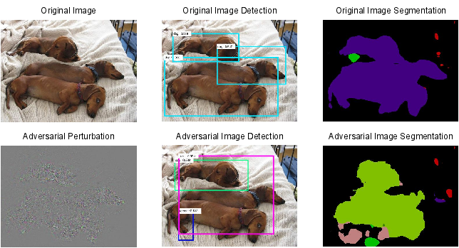

#  Adversarial Examples for Semantic Segmentation and Object Detection 
This repo privdes a simple algorithm, **Dense Adversary Generation (DAG)**, to find adversarial examples for semantic segmentation and object detection (https://arxiv.org/abs/1703.08603). An adversarial example which let **both** the detection network and the segmentation network fail is shown below：

## Code

### generate_config.m

The config arguments:
- `model_select`: models used for generating adversarial examples.
- `MAX_ITER`: max iteration number for generating adversarial examples (default = 150 for detection, = 200 for segmentation).
- `step-length`: max pixel value change at each iteration (default = 0.5)
- `net_model`: network model where the last layer (loss) is removed and backward is enabled.
- `net_weight`: network weight
- for segmentation
  - `shape`: the segmenation shape of the adversarial example: circle, diamond, strip.
 
### demo.m

A simple demo which computes the adversarial examples for object detection and semantic segmentation algorithms, the output includes: 
1. visualization of segmentation or detection result of the adversarial example; 
2. visualization of original image `X`, adversarial examples `X + r`, adversarial perturbation `r`.

## Software Requirements

1. Caffe *should* use the version from Microsoft (https://github.com/Microsoft/caffe) which supports the roi_pooling_layer
2. Caffe *must* be complied with 'matcaffe'

## Citing DAG

If you find DAG is useful in your research, please consider citing:

    @inproceedings{xie2017adversarial,
        title={Adversarial Examples for Semantic Segmentation and Object Detection},
        author={Xie, Cihang and Wang, Jianyu and Zhang, Zhishuai and Zhou, Yuyin and Xie, Lingxi and Yuille, Alan},
        Booktitle={International Conference on Computer Vision},
        year={2017},
        organization={IEEE}
    }
